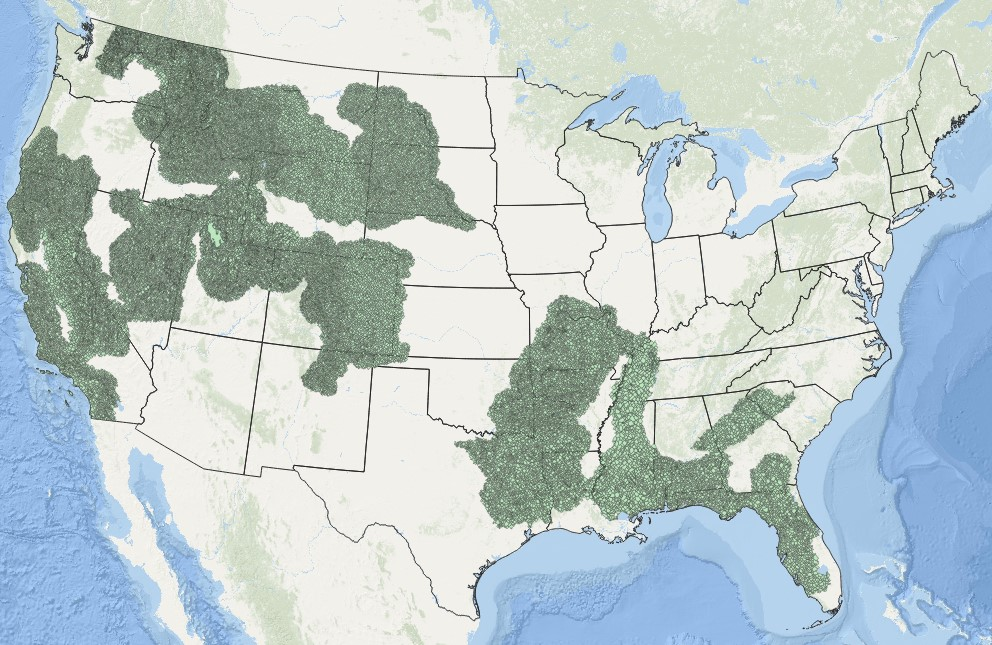

## Challenge and opportunity

Land managers and researchers rely on polygons to-among other things-stratify the landscape for assessment and summarization of key attributes.  Some examples include:

{style="float:right; margin-left: 25px;" fig-alt="\"Provisional LTAs." fig-align="right" width="450" }

1.	Watershed boundaries (area of land that drains all the streams and rainfall to a common outlet) are used by hydrologists to help understand and manage waterflows and model potential pollution impacts.  Land managers in general often use watersheds boundaries for cumulative impact assessments and to summarize land use. 
2.	Hexagons are often (e.g. than rectangles) used in research and cartography as they are less prone to distortion, nearest neighbor mapping is simplified as the centeroid of all six surrounding cells has the same distance and they can be less likely to highlight linear features.  
3.	Ecoregions are geographic areas defined by similar flora, fauna and/or ecosystems.  They often have characteristic soils, climate and landforms.  They are typically large (>10k sqm), but can vary and size

The USFS has invested heavily in development of a hierarchical Ecological Classification System (ECS) that has units defined by biotic and environmental factors, and units ranging in size from Land Type Phases (10-100s of acres) to Domains (up to millions of square miles).   Mapping of the larger polygons has been completed nationally, but mapping of the smaller units is underway.

The Terrestrial Ecological Unit Inventory is the USFS approach for mapping the smaller units of the ecological hierarchy in a standardized way. The first incomplete level of the hierarchy is the Land Type Associations (LTAs), and a recent USFS effort has mapped just over 62k LTA boundaries as of June 2025. LTA mapping has been driven by the latest ecological knowledge and eCognition software.  The completion of these LTA boundaries comes with opportunities to assess their robustness and utility.  

## Goals of this exploration and our test landscape

The LTAs are new.   Working with Dr. Sarah Anderson (Ecologist, USFS), [Conservation Data Lab (CDL)](https://conservationdatalab.org/) members [Becky Lane](https://conservationdatalab.org/people/members/becky_lane) and [Mollie Haremza](https://conservationdatalab.org/people/members/mollie_haremza) plus CDL lead [Randy Swaty](https://conservationdatalab.org/people/leads/randy_swaty) aimed to help understand how well LTAs may work for landscape management.  In a separate project Mollie used LTAs to stratify soil characteristics relevant for Longleaf Pine restoration.  Here Becky and Randy:

1. Broadly compared BpS and EVT distributions between LTAs, HUC 12 watersheds and hexagons
2. Wrote R scripts that:
    * selects LTAs and HUC 12 watersheds and creates hexagons that intersect a selected National Forest (AoI)
    * downloads [LANDFIRE](https://www.landfire.gov/) [Biophysical Settings(BpS)](https://www.landfire.gov/vegetation/bps) and [Existing Vegetation Type (EVT)](https://www.landfire.gov/vegetation/evt) data for the AoI
    * extracts BpS and EVT values then joins attributes per polygon (e.g., HUC 12 watersheds)
    * creates summary visualizations and statistics
3. Developed and deployed this website in R, hosted on GitHub

 

{style="float:right; margin-left: 25px;" fig-alt="\"Provisional LTAs." fig-align="right" width="900" }
    
    
    
    
    
    
    
    
