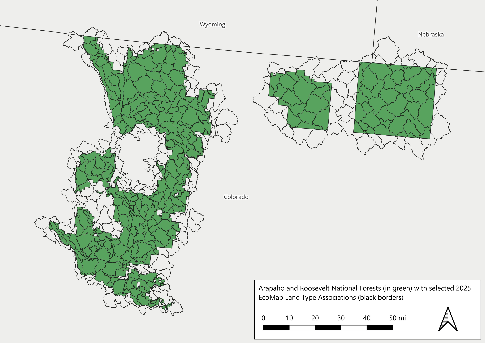
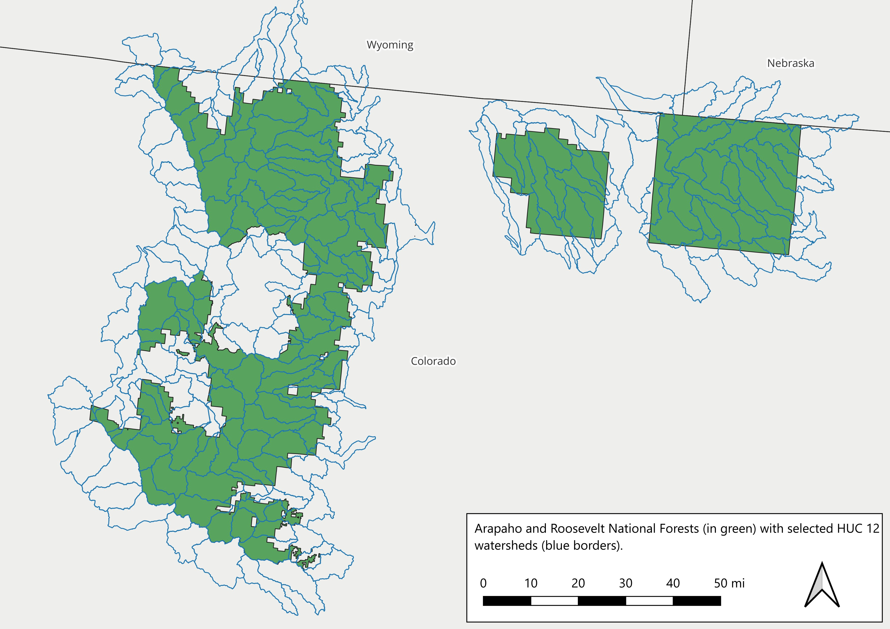

Below we outline some of the basics of the polygons used in this exploration, the Land Type Associations (LTAs), HUC 12 watersheds and the hexagons.

## Land Type Associations

Arapaho and Roosevelt National Forests (green) and intersecting LTAs (black)

 

{style="float:right; margin-left: 25px;" fig-alt="\"Provisional LTAs." fig-align="right" width="900" }

## HUC 12 Watersheds

Arapaho and Roosevelt National Forests (green) and selected HUC 12 watersheds (blue).

 

{style="float:right; margin-left: 25px;" fig-alt="\"Provisional LTAs." fig-align="right" width="900" }

## Hexagons

Arapaho and Roosevelt National Forests (green) and selected hexagons (orange).

 

{style="float:right; margin-left: 25px;" fig-alt="\"Provisional LTAs." fig-align="right" width="900" }

